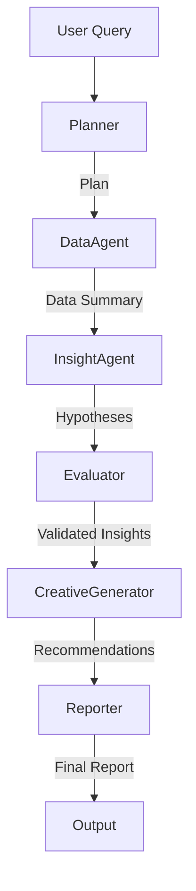

# Agent Architecture

## Agent Roles

- **Planner**: Decomposes the high-level user query into a structured execution plan.
- **Data Agent**: Interacts with the pandas DataFrame to calculate metrics and segment data.
- **Insight Agent**: Analyzes data summaries to generate hypotheses and identify drivers of performance changes.
- **Evaluator**: Validates the generated insights and report against the original query and data.
- **Creative Generator**: Uses the insights to generate new ad copy (headlines, messages) for underperforming campaigns.
